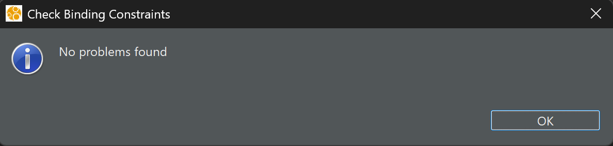

# System automatycznego podlewania ogrodu
## Opis projektu

System automatycznego podlewania ogrodu to system czasu rzeczywistego zaprojektowany w języku AADL. Celem modelu jest monitorowanie warunków glebowych i atmosferycznych oraz automatyczne zarządzanie nawadnianiem ogrodu. System inteligentnie dostosowuje harmonogram podlewania w oparciu o wilgotność gleby, prognozy pogody oraz predefiniowane ustawienia użytkownika.

## Diagram architektury


*Diagram przedstawia architekturę systemu automatycznego podlewania ogrodu z podziałem na komponenty sprzętowe (czujniki, zawory, pompa), jednostki przetwarzania (procesor główny, pamięć), moduły komunikacyjne (I2C, WiFi) oraz procesy sterujące (zbieranie danych z czujników, kontrola podlewania, powiadomienia).*

## Komponenty systemu

### Pakiet
- `GardenIrrigationSystem` – główny pakiet zawierający wszystkie komponenty systemu automatycznego podlewania ogrodu.

### Data
- `SoilMoistureData` – dane z czujników wilgotności gleby.
- `TemperatureData` – dane z czujnika temperatury otoczenia.
- `RainPredictionData` – dane dotyczące prognozy opadów.
- `WaterLevelData` – dane o poziomie wody w zbiorniku.
- `CommandData` – komendy przesyłane z aplikacji użytkownika.
- `IrrigationScheduleData` – dane harmonogramu podlewania.
- `ZoneConfigData` – konfiguracja stref podlewania.

### Wątki
- `MoistureSensorMonitor` – wątek monitorujący odczyty czujników wilgotności gleby.
- `WeatherDataCollector` – wątek zbierający dane pogodowe.
- `IrrigationController` – wątek sterujący zaworami podlewającymi.
- `TankMonitor` – wątek monitorujący poziom wody w zbiorniku.
- `CameraController` – wątek zarządzający kamerą i wykonujący zdjęcia stanu ogrodu.
- `NotificationManager` – wątek wysyłający powiadomienia do użytkownika.

### Procesy
- `SensorProcess` – proces zawierający wątki zbierające dane z czujników.
- `ControlProcess` – proces zawierający logikę sterowania systemem.
- `NotificationProcess` – proces obsługujący powiadomienia i alerty.

### Urządzenia
- `MoistureSensor` – czujniki wilgotności gleby.
- `TemperatureSensor` – czujnik temperatury otoczenia.
- `SolenoidValve` – elektrozawory sterujące dopływem wody do poszczególnych stref.
- `WaterPump` – pompa wodna.
- `WaterLevelSensor` – czujnik poziomu wody w zbiorniku.
- `Camera` – kamera monitorująca stan ogrodu.
- `WiFiModule` – moduł komunikacji bezprzewodowej.

### Magistrale
- `I2CBus` – magistrala komunikacyjna dla czujników.
- `WiFiBus` – magistrala do komunikacji bezprzewodowej.

### Procesory
- `MainController` – główny procesor sterujący pracą całego systemu.

### Pamięć
- `SystemMemory` – pamięć operacyjna dla systemu.

### System
- `GardenIrrigationSystem` – kompletny system integrujący wszystkie komponenty.

## Funkcjonalności systemu

1. **Monitorowanie warunków** – system regularnie zbiera dane z czujników wilgotności gleby i temperatury.
2. **Inteligentne podlewanie** – automatyczne dostosowanie częstotliwości i długości podlewania w oparciu o odczyty wilgotności.
3. **Oszczędzanie wody** – integracja z prognozami pogody pozwala na wstrzymanie podlewania przed spodziewanymi opadami.
4. **Podział na strefy** – możliwość konfiguracji różnych harmonogramów podlewania dla różnych stref ogrodu.
5. **Monitoring zbiornika** – ciągłe monitorowanie poziomu wody w zbiorniku z alertami przy niskim stanie.
6. **Dokumentacja wizualna** – system wykonuje zdjęcia ogrodu, umożliwiając śledzenie jego stanu.
7. **Powiadomienia** – system wysyła alerty o niskim poziomie wody, problemach z czujnikami lub zaworami.
8. **Kontrola zdalna** – możliwość zdalnego sterowania systemem poprzez aplikację.

## Przepływy danych

System implementuje następujące przepływy danych:
- Monitoring wilgotności -> Analiza -> Decyzja o podlewaniu -> Sterowanie zaworami
- Prognoza pogody -> Adjustacja harmonogramu podlewania
- Stan zbiornika -> Powiadomienia dla użytkownika
- Harmonogram -> Wykonanie podlewania -> Dokumentacja fotograficzna

## Analiza Scheduling

Analiza schedulingu została przeprowadzona w celu weryfikacji, czy system jest w stanie wykonać wszystkie zadania w zdefiniowanych ramach czasowych na docelowym procesorze.

### Podsumowanie wyników

Procesor `MainCPU` jest schedulowalny z wykorzystaniem na poziomie 0.4%. Wszystkie zdefiniowane wątki w systemie są schedulowalne, co oznacza, że ich maksymalne czasy odpowiedzi nie przekraczają zdefiniowanych deadline'ów.

### Szczegółowy raport

```
Test scheduability Report

Processor Utilization/Scheduling Results
Schedulability Results
MainCPU: Processor GardenIrrigation_impl_Instance.MainCPU is schedulable with utilization 0.4%
thread name, period, deadline, execution time, phase offset, priority, max response time, schedulability 
GardenIrrigation_impl_Instance.SensorsProc.MoistureSensor, 60000000, 50000000, 50000, 0, 7, 50000.0, true
GardenIrrigation_impl_Instance.ControlProc.IrrigationCtrl, 60000000, 50000000, 200000, 0, 6, 250000.0, true
GardenIrrigation_impl_Instance.NotificationProc.NotifyManager, 60000000, 30000000, 100000, 0, 5, 350000.0, true
GardenIrrigation_impl_Instance.SensorsProc.TankMonitor, 300000000, 200000000, 50000, 0, 4, 400000.0, true
GardenIrrigation_impl_Instance.SensorsProc.WeatherData, 2147483647, 2147483647, 500000, 0, 3, 900000.0, true
GardenIrrigation_impl_Instance.ControlProc.Camera, 2147483647, 1000000000, 2000000, 0, 2, 2000000.0, true
GardenIrrigation_impl_Instance.NotificationProc.CameraCtrl, 2147483647, 1000000000, 2000000, 0, 1, 2000000.0, true


Thread binding report
thread SensorsProc.MoistureSensor(0,001 MIPS) ==> processor MainCPU(1,00MIPS) Utilization 0,1%
thread SensorsProc.WeatherData(0,000 MIPS) ==> processor MainCPU(1,00MIPS) Utilization 0,0%
thread SensorsProc.TankMonitor(0,000 MIPS) ==> processor MainCPU(1,00MIPS) Utilization 0,0%
thread ControlProc.IrrigationCtrl(0,003 MIPS) ==> processor MainCPU(1,00MIPS) Utilization 0,3%
thread ControlProc.Camera(0,001 MIPS) ==> processor MainCPU(1,00MIPS) Utilization 0,1%
thread NotificationProc.NotifyManager(0,002 MIPS) ==> processor MainCPU(1,00MIPS) Utilization 0,2%
thread NotificationProc.CameraCtrl(0,001 MIPS) ==> processor MainCPU(1,00MIPS) Utilization 0,1%
```

## Analiza Wiązania Komponentów (Binding Constraints)

Analiza wiązania komponentów (Check Binding Constraints) została przeprowadzona w celu weryfikacji poprawności przypisania komponentów oprogramowania do zasobów sprzętowych.



*Wynik analizy Check Binding Constraints. Nie znaleziono żadnych problemów.*

## Analiza Spójności Połączeń (Connection Consistency)

Analiza spójności połączeń została wykonana w celu zapewnienia, że wszystkie połączenia między komponentami systemu są poprawnie zdefiniowane i nie występują żadne niespójności. Wyniki analizy potwierdzają, że nie znaleziono żadnych błędów.

### Szczegółowy raport

```
Port Connection Consistency Report
```

## Analiza Spójności ARINC429 (ARINC429 Consistency)

Analiza spójności dla standardu ARINC429 została przeprowadzona, aby zweryfikować zgodność połączeń wykorzystujących ten protokół. Wyniki analizy wskazują na brak błędów i pełną spójność.

### Szczegółowy raport

```
ARINC429 Connection Consistency Report
```
